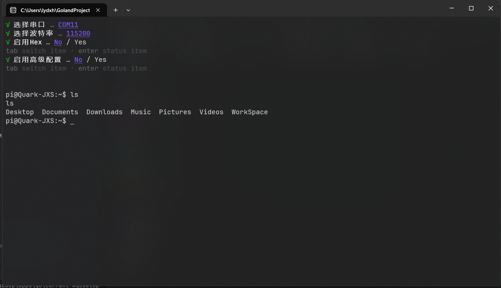
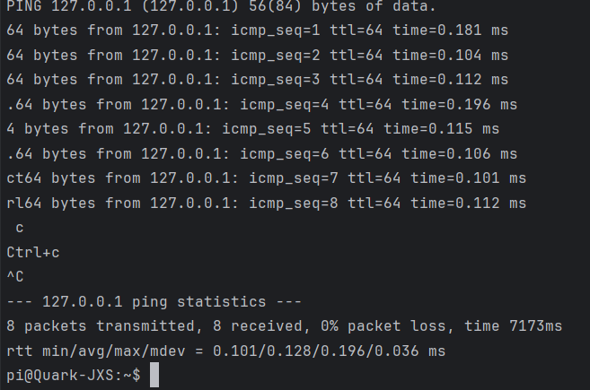
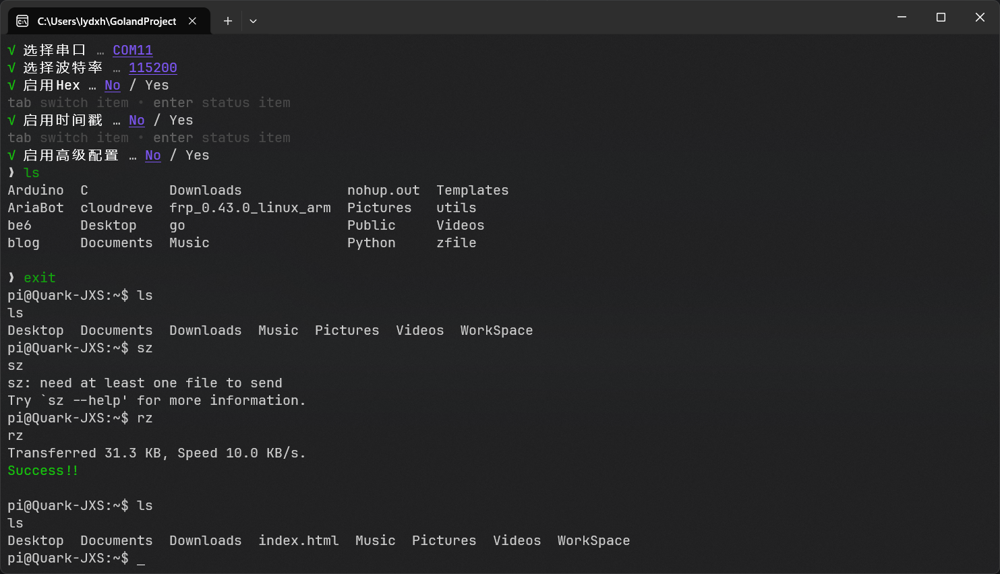
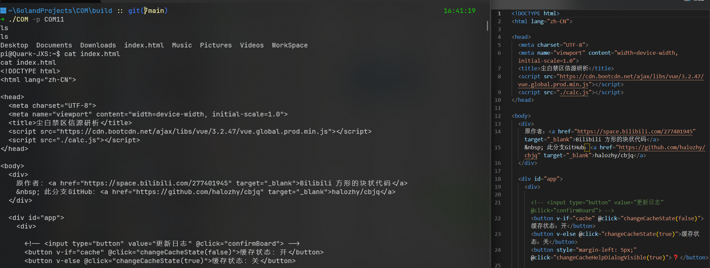
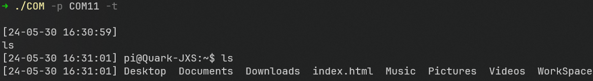
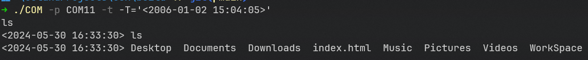
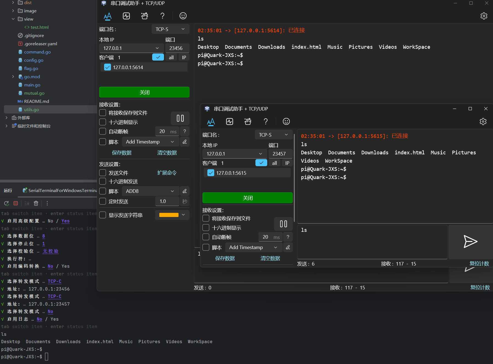

# SerialTerminalForWindowsTerminal
在开始这个项目之前，我发现Windows Terminal对串口设备的支持并不理想。

我试用了一段时间[Zhou-zhi-peng的SerialPortForWindowsTerminal](https://github.com/Zhou-zhi-peng/SerialPortForWindowsTerminal/)项目。

然而，这个项目存在着编码转换的问题，导致数据显示乱码，并且作者目前并没有进行后续支持。因此，我决定创建了这个项目。

## 功能进展
* [x] Hex接收发送(大写hex与原文同显)
* [x] 双向编码转换
* [x] 活动端口探测
* [x] 数据日志保存
* [x] Hex断帧设置
* [x] UDP数据转发(支持多服)
* [x] TCP数据转发(支持多服)
* [x] 参数交互配置
* [x] Ctrl组合键
* [x] 文件接收发送(trzsz lrzsz都支持)

## 运行示例

1. 参数帮助 `./COM`

    

2. 输入设备输出UTF8 终端输出GBK `./COM -p COM8 -b 115200 -o GBK`

    
3. 彩色终端输出

   

4. Hex接收 `./COM -p COM8 -b 115200 -i hex`
   
   
5. Hex发送 `./COM -p COM8 -b 115200`

   
6. 交互配置 `./COM`

   
7. Ctrl组合键发送指令.ctrl `.ctrl c`
   
   
8. 文件上传演示 `index.html`
   
   内容对比
   
9. 时间戳 `./COM -p COM8 -t`
   
10. 格式修改 `./COM -p COM11 -t='<2006-01-02 15:04:05>'`
    
11. 多服同步转发 `./COM -p COM11 -f 1 -a 127.0.0.1:23456 -f 1 -a 127.0.0.1:23457`
   