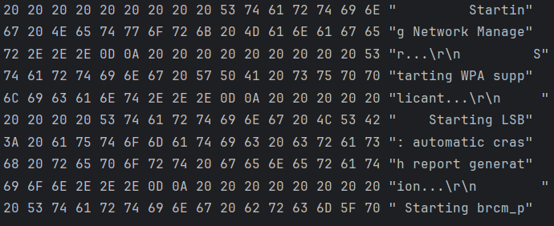

# SerialTerminalForWindowsTerminal
在编写这个项目之前在windows Terminal中对串口设备的支持不是很棒，

用过一段时间的
[SerialPortForWindowsTerminal](https://github.com/Zhou-zhi-peng/SerialPortForWindowsTerminal/)
项目。
此项目没有编码转换能力在使用过程中有乱码的问题，并且作者截至目前并没有进行后续支持，于是我便编写了此项目

## 运行示例

1. 参数帮助 `./COM`

    

2. 输入设备输出UTF8 终端输出GBK `./COM -p COM8 -b 115200 -o GBK`

    
3. 彩色终端输出

   

4. Hex接收 `./COM -p COM8 -b 115200 -i hex`
   
   
5. Hex发送 `./COM -p COM8 -b 115200`

   
